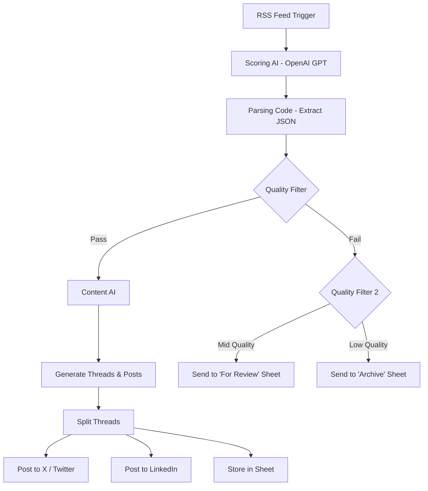

# 📬 AI-Powered Autonomous Newsletter & Social Media Workflow
**RSS → AI Scoring → AI Content Creation → Quality Filtering → Sheets Logging → Auto-Posting to X + LinkedIn**

---

## 🚀 Overview

This project is a **fully autonomous content-curation and social-posting pipeline** built using **n8n**, **OpenAI models**, and **Google Sheets**.

It automatically:
- Pulls new articles from an **RSS feed**
- Evaluates them using **AI for quality, relevance, and topical fit**
- Generates platform-ready content (**Twitter threads + LinkedIn posts**)
- Filters out low-quality articles
- Stores all generated content in **Google Sheets**
- Automatically posts the approved content to **X (Twitter)** and **LinkedIn**
- Archives or sends items for manual review when necessary

This workflow removes the need for manual content research, writing, scheduling, or approval pipelines.

---

## 🎯 Motivation

Content teams waste significant time:
- Scanning multiple websites for relevant articles
- Summarizing or converting articles into social-media content
- Maintaining a consistent posting schedule
- Filtering low-quality or irrelevant content
- Organizing, reviewing, and archiving links

**This workflow solves these problems by giving you:**
- Zero-touch content discovery
- Automated scoring + summarization
- Professional-grade social content generation
- Auto-posting without human involvement
- A structured Google Sheets repository of all content

*Perfect for teams producing frequent newsletters, daily content digests, or automated posts.*

---

## 👤 Who Is This For?

This system is ideal for:
- Content creators
- Marketing teams
- Newsletter authors
- Social media managers
- Automation enthusiasts
- Solo creators wanting daily content without effort
- Agencies running multiple content pipelines

If you want high-quality curated content without doing any manual work—this workflow is for you.

---

## 🧩 Workflow Architecture (High-Level)

Below is the actual architecture extracted from your `Newsletter_Workflow.json`:

---

## 🧠 What the Workflow Achieves

### ✔ Automatically fetches new articles from an RSS feed
Using RSS Feed Trigger, with customizable poll frequency.

### ✔ Uses AI to evaluate article usefulness
It scores based on:
- **Quality score (1–10)**
- **Relevance score (1–10)**
- **Key topics**
- **Action indicator:** `PUBLISH` / `REVIEW` / `ARCHIVE`

### ✔ Generates platform-ready content
Content AI produces:
- A formatted **Twitter thread** (3–4 tweets)
- A **LinkedIn post** with summary, insights, hashtags, CTA

### ✔ Applies intelligent routing
Depending on quality score:
- **>4** → Publish automatically
- **>=3** → Send for manual review
- **<3** → Archive immediately

### ✔ Auto-Posts Approved Items
- Sends each tweet (from the thread) to **X**
- Posts LinkedIn content through the **LinkedIn API**

### ✔ Logs everything into Google Sheets
Three tabs:
1. `{{GENERATED_CONTENT_SHEET}}` – approved and published
2. `{{FOR_REVIEW_SHEET}}` – requires human review
3. `{{ARCHIVE_SHEET}}` – discarded items

---

## 🧱 Tech Stack

| Component | Purpose |
|-----------|---------|
| **n8n** | Automation & orchestration |
| **OpenAI Chat Models** | Article scoring + content generation (GPT-4o, GPT-4.1-mini) |
| **Google Sheets API** | Logging, analytics, storage |
| **LinkedIn API** | Auto-posting |
| **Twitter/X API** | Auto-posting of threads |
| **RSS Feed Parser** | Article ingestion |

---

## 📄 Data Flow & Storage (Dummy Example Tables)

### 1. Generated Content Sheet (`{{GENERATED_CONTENT_SHEET}}`)
| Date Created | Article Title | Quality Score | Twitter Content | LinkedIn Content |
|--------------|---------------|---------------|-----------------|------------------|
| 2025-01-12 | "AI in HR Automation" | 8 | "Tweet1…Tweet2…" | "Full LinkedIn post…" |
| 2025-01-13 | "Workplace Trends 2025" | 9 | "Tweet1…Tweet2…" | "LinkedIn post…" |

### 2. For Review (`{{FOR_REVIEW_SHEET}}`)
| Title | Link | Pub Date | Quality Score | Summary | Content Angle |
|-------|------|----------|---------------|---------|---------------|
| "Hybrid Work Challenges" | URL | 2025-01-10 | 5 | Short AI summary | Suggested angle |

### 3. Archive (`{{ARCHIVE_SHEET}}`)
| Title | Link | Pub Date | Quality Score | Reason |
|-------|------|----------|---------------|--------|
| "Low-Quality Article" | URL | 2025-01-08 | 2 | "Summary text…" |

---

## ⚙️ Setup Instructions

### 1. Import the Workflow
In n8n:
`Settings → Import from File → Newsletter_Workflow.json`

### 2. Replace Template Variables
Update the following variables inside your workflow:

| Variable | Meaning |
|----------|---------|
| `{{RSS_FEED_URL}}` | The feed you want to monitor |
| `{{OPENAI_API_KEY}}` | Your OpenAI API key |
| `{{GOOGLE_SHEET_ID}}` | Master spreadsheet ID |
| `{{GENERATED_CONTENT_SHEET}}` | Tab where approved content is logged |
| `{{FOR_REVIEW_SHEET}}` | Tab for manual review |
| `{{ARCHIVE_SHEET}}` | Tab for archived items |
| `{{LINKEDIN_ORG_ID}}` | ID of your company page |
| `{{TWITTER_APP_CREDS}}` | X/Twitter OAuth credentials |

### 3. Set Up Google Sheets Credentials
Inside n8n → Credentials → Add New → **Google Sheets OAuth2**.

### 4. Configure OpenAI
Inside n8n → Credentials → **OpenAI API**.

### 5. Connect Twitter & LinkedIn
Add credentials under:
- “Twitter OAuth2 API”
- “LinkedIn OAuth2”

### 6. Enable Workflow
Set the workflow status to **active**.
*n8n will now automatically run on schedule.*

---

## 📝 Example Output (Generated by Content AI)

### Twitter Thread (Dummy Example)
> • AI is reshaping modern HR workflows — but most companies still underutilize it.
>
> • Here are 3 practical automations you can deploy today:
> 1) Resume parsing
> 2) Internal query bots
> 3) Automated onboarding
>
> • Want deeper insights? Full article inside 👇
> `<article link>`

### LinkedIn Post (Dummy Example)
> AI continues to transform HR operations, yet most teams still lack the workflows needed to fully leverage automation...
>
> Here are 3 takeaways:
> • Automation reduces manual workload by 40–60%
> • Employee satisfaction increases when HR bottlenecks are removed
> • AI improves decision-making across recruitment & retention
>
> Full article below 👇
>
> #futureofwork #ai #automation

---

## 📌 Conclusion

This project provides a complete hands-off content engine capable of:
1. Researching news
2. Scoring & analyzing articles
3. Writing platform-specific content
4. Storing structured data
5. Filtering quality
6. Auto-posting to X + LinkedIn

It removes human bottlenecks while ensuring content remains informative, high-quality, and consistent.

**If you're running a newsletter, daily content stream, or automated posting pipeline — this workflow eliminates 90% of your manual work.**
